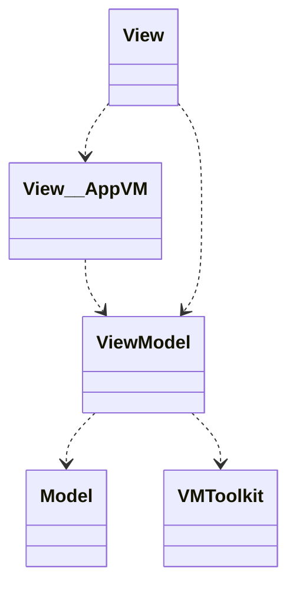
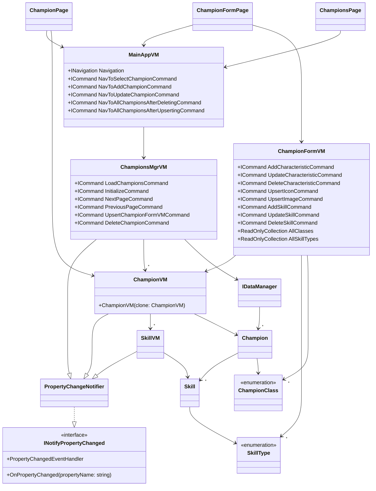

# MVVM_LoL_master_detail

* [Instructions (FR)](#instructions-fr)
* [Peculiarities](#peculiarities)
    - [Delete from detail page](#delete-from-detail-page)  
    - [Navigating to detail page](#navigating-to-detail-page)  
    - [Auto-focus](#auto-focus)  
* [Screenshots](#screenshots)
* [Class diagrams: M, V, VM... AppVM](#class-diagrams-m-v-vm-appvm)

  
## Instructions (FR)

Réaliser une application MAUI avec un MVVM "maison". 
Je vous fournis le modèle, et peut-être quelques vues au fur et à mesure.  
  
J'attends de vous :
- [x] la réalisation d'un toolkit MVVM (bibliothèque de classes),
- [x] le _wrapping_ des classes du modèle par des VM (à chaque fois que c'est nécessaire),
- [x] l'utilisation de commandes pour les différentes fonctionnalités,
- [x] l'utilisation d'une VM _applicative_ (navigation, index, sélection...).

Faites ce que vous pouvez avec, dans l'ordre :
- [x] l'affichage de la collection de Champions. La possibilité de naviguer de n en n champions (5 champions par page, ou 10, etc.) et la pagination doivent être gérées. 
- [x] Permettez la sélection d'un champion pour le voir dans une page (on n'utilisera que ses propriétés simples (```Name```, ```Bio```, ```Icon```) puis ```LargeImage```).
- [x] Ajoutez la gestion des caractéristiques (```Characteristics```).
- [x] Ajoutez la gestion de la classe du champion.
- [x] Permettez la modification d'un champion existant (depuis la page du champion, et depuis un swipe sur l'item sélectionné dans la collection).
- [x] Permettez l'ajout d'un nouveau champion.
- [x] Ajoutez la gestion des skills.
- [ ] ~~Ajoutez la gestion des skins.~~

## Peculiarities

### Delete from detail page
The instructions did not mention adding a `Delete` button in detail pages, but it was useful when testing the app directly on Windows -- i.e. with no touch functionality or swipe gestures.

### Navigating to detail page
Users can click / tap a champion's `Icon` to navigate to their detail page. The entire list item is not clickable -- it makes navigating to a champion's detail page a little harder, but it allows us to implement swiping on said list item, in order to reveal `Update`and `Delete` buttons.

Before we made this compromise, swiping was conflicting with tapping, and it was quite difficult to access those buttons.

### Auto-focus
Upon updating a skill or a characteristic, Android seems to auto-focus the element closest to the top of the visible `Scrollview`. That includes opening the user's keyboard or numpad...

## Screenshots
The app is not meant to be pretty, but the hope is that it is usable, and that the navigation experience is pleasant. At the time of this writing, it looks like this:  


## Class diagrams: M, V, VM... AppVM

We're applying the MVVM architecture pattern in **both** common senses of the term: 
* an app-dependent VM takes care of navigation through commands, 
* and a model-dependent VM provides properties for binding, sends notifications when its properties change, and wraps the model.



Here is what our classes look like


